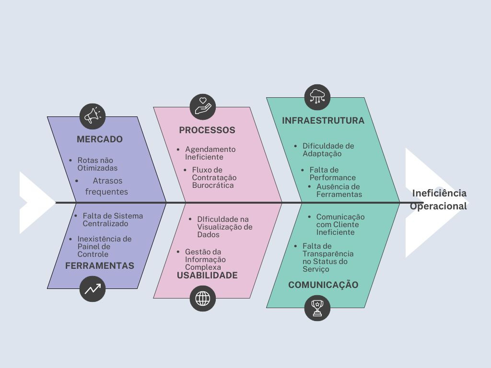

# 🔍 Identificação da Oportunidade

📈 Nos últimos anos, os serviços remotos de lava-jato têm crescido constantemente, impulsionando o interesse e a procura dos clientes. Esse crescimento, no entanto, traz consigo diversos desafios para as empresas. A gestão da informação e a administração se tornam complexas, especialmente para visualizar os agendamentos e as necessidades dos clientes.

A logística de deslocamento é outro obstáculo importante: uma dificuldade acaba gerando outra, afetando diretamente a pontualidade e a eficiência. Situações como atrasos nos pedidos e uma experiência de compra frustrante são comuns, o que pode limitar as vendas e a fidelização dos clientes. Além disso, a falta de controle e organização pode levar à diminuição da qualidade do serviço.

---

!!! warning "Causa principal"
    Grande parte dessas falhas surge da ausência de ferramentas adequadas para listar, organizar e agendar os serviços.  
    A ineficiência nas operações acaba prejudicando o negócio e impede a empresa de atender de forma ágil e organizada.

!!! tip "Oportunidade"
    O cenário mostra espaço para adoção de ferramentas **modernas e atualizadas** que otimizem processos e melhorem a experiência tanto para os clientes quanto para a empresa.

---

