# **Evidências de Execução**

Este documento consolida as evidências de execução do cronograma, do processo (ESW e ER) e das entregas parciais do produto até o momento.

## **1. Cronograma e Marcos**

| Unidade/Ciclo | Período (planejado) | Evidências | Links |
| :-- | :-- | :-- | :-- |
| Unidade 1 | 26/08–06/09 (fase inicial) | Definição de escopo, políticas e visão do produto | [Cenário Atual](../visao_produto/cenario_atual.md) • [Solução Proposta](../visao_produto/solucao_proposta.md) • [Política de Commits](../politicas_equipe/commits.md) • [Política de Branches](../politicas_equipe/branches.md) • [Política de Issues](../politicas_equipe/issues.md) • [Política de PR](../politicas_equipe/pull_request.md) |
| Fase 1: Planejamento Global | 26/08–06/09 | Escopo total, definição de MVP e divisão em incrementos | [Solução Proposta](../visao_produto/solucao_proposta.md) • [Requisitos de Software](../visao_produto/requisitos_software.md) |
| Fase 1.1: Planejamento Requisitos (Inc.1) | 09/09–25/11 | Refinamento de requisitos do Incremento 1 (MVP) | [Requisitos de Software](../visao_produto/requisitos_software.md) • [Backlog](../backlog/backlog.md) |
| Fase 1.2: Design & Prototipagem (Inc.1) | 03/11–25/11 | Protótipos e validação com cliente para MVP | [Protótipos](../entregas/evidencias_execucao.md#protótipos-e-mockups) |
| Fase 1.3: Construção Rápida (Inc.1) | 26/11–02/12 | Implementação e integração das funcionalidades do MVP | [Evidências de Execução](./evidencias_execucao.md#cobertura-do-mvp-tabela-unificada) |
| Fase 1.4: Finalização & Implantação (Inc.1) | 02/12 | Testes, correções e entrega funcional do MVP | [Evidências de Execução](./evidencias_execucao.md) |
| Fase 2.1: Planejamento Requisitos (Inc.2) | 02/12–02/01 | Planejamento de melhorias e itens fora do MVP | [Backlog](../backlog/backlog.md) |
| Fase 2.2: Design & Prototipagem (Inc.2) | 02/01–02/02 | Design das funcionalidades finais | (Previsto) |
| Fase 2.3: Construção Rápida (Inc.2) | 02/02–02/05 | Codificação e integração total | (Previsto) |
| Fase 2.4: Finalização & Implantação (Inc.2) | 02/05–02/06 | Testes finais, ajustes e entrega completa | (Previsto) |

> Referência do planejamento completo: [Cronograma de Entregas](../visao_produto/cronograma_entregas.md).

## **2. Processo (ESW e ER)**

- **Engenharia de Requisitos (ER):**
  - USM descrito e referenciado (transversal ao processo) em [Engenharia de Requisitos](../visao_produto/engenharia_requisitos.md).
  - Backlog derivado do USM com features, US e priorização em [Backlog de Produto](../backlog/backlog.md).
  - RNFs documentados e validados em [Requisitos de Software](../visao_produto/requisitos_software.md).
- **Engenharia de Software (ESW):**
  - Políticas de equipe ([Commits](../politicas_equipe/commits.md), [Branches](../politicas_equipe/branches.md), [Issues](../politicas_equipe/issues.md), [Pull Request](../politicas_equipe/pull_request.md)), estratégia ([Estratégias](../visao_produto/estrategias.md)), e organização das entregas ([Cronograma](../visao_produto/cronograma_entregas.md)).

## **3. Entregas Parciais do Produto**

| Tipo | Evidência | Link |
| :-- | :-- | :-- |
| Mapa USM (visual) | Miro com jornadas e histórias | [Requisitos de Software](../visao_produto/requisitos_software.md) |
| Backlog estruturado | Features, US e priorização | [Backlog de Produto](../backlog/backlog.md) |
| RNFs do sistema | Tabela completa com categorias | [Requisitos de Software](../visao_produto/requisitos_software.md) |

### **Protótipos e Mockups**

#### Baixa fidelidade (cliente/admin)

{ width=100% }

#### Alta fidelidade (Figma)

<iframe style="border:1px solid rgba(0,0,0,0.1);" width="100%" height="800" src="https://www.figma.com/embed?embed_host=share&url=https://www.figma.com/file/G5HVjXRLeve1BeBBazx2S8/WaveOn---UI-UX-Design?type=design&node-id=0-1&mode=design" allowfullscreen></iframe>

### **Aplicação inicial do código**

As imagens abaixo evidenciam a primeira aplicação do código e como ficaram algumas telas do protótipo inicial:

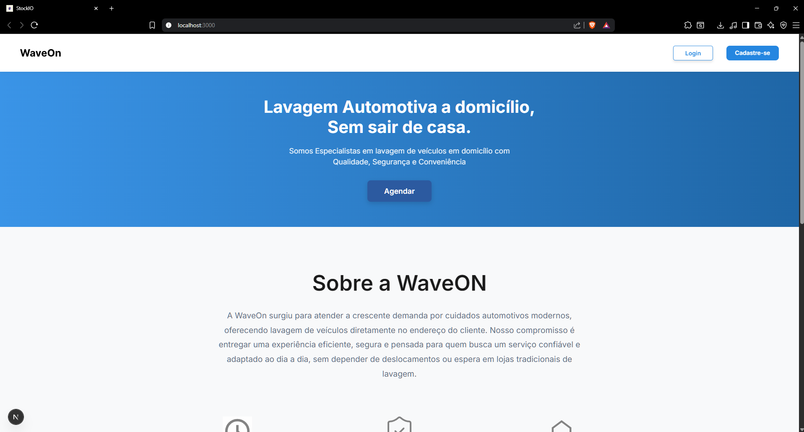

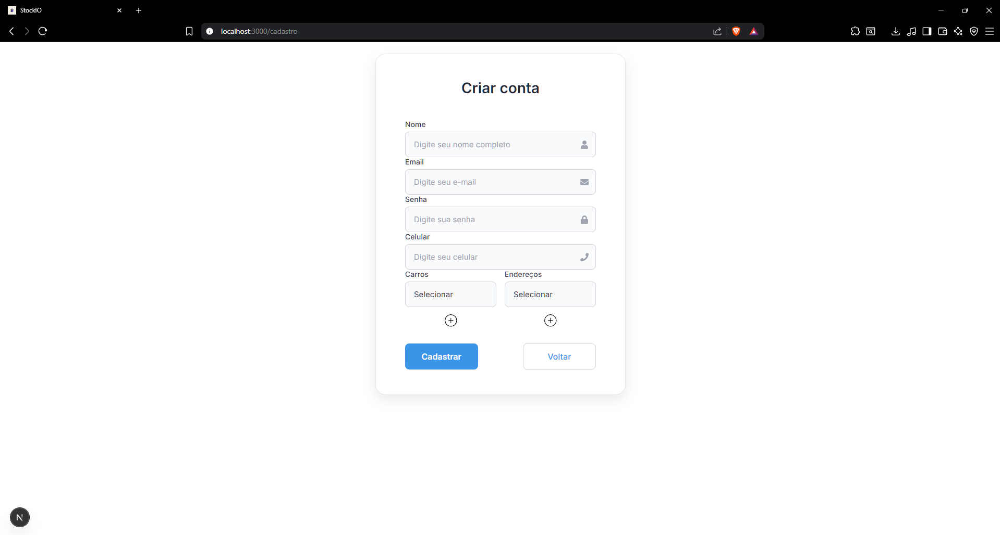

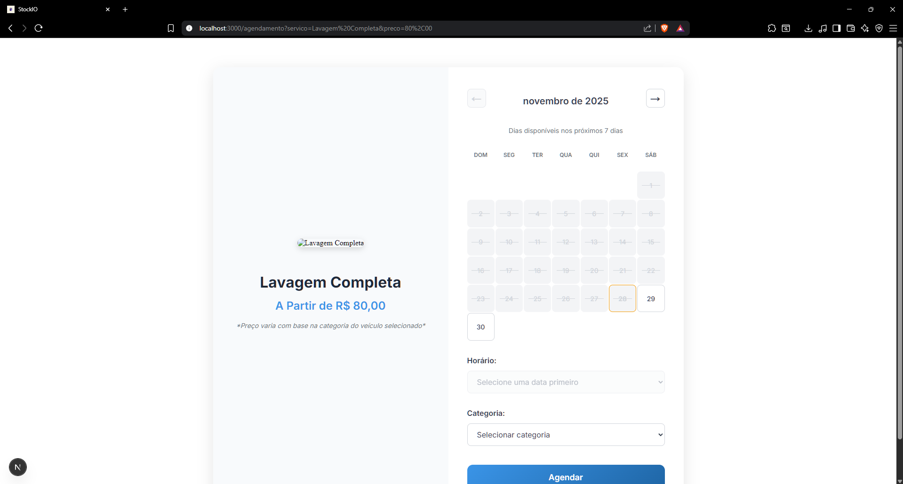

### Versão Final (capturas atualizadas)

As imagens abaixo registram a versão final do protótipo/aplicação com telas-chave. Formato visual igual às demais evidências do documento.

### Cobertura do MVP (Tabela Unificada)

| Tela | Função evidenciada | RF(s) | US(s) |
| :-- | :-- | :-- | :-- |
| Home | Visualização inicial dos serviços e navegação básica | <a href="../../visao_produto/requisitos_software/#rf-c01">RF-C01</a> | <a href="../../backlog/backlog/#us-c01">US-C01</a> |
| Serviços | Catálogo de serviços e preços | <a href="../../visao_produto/requisitos_software/#rf-c01">RF-C01</a> | <a href="../../backlog/backlog/#us-c01">US-C01</a> |
| Cadastro | Criação de conta de cliente | <a href="../../visao_produto/requisitos_software/#rf-c03">RF-C03</a> | <a href="../../backlog/backlog/#us-c04">US-C04</a>  |
| Login (Cliente/Admin) | Autenticação e acesso administrativo | <a href="../../visao_produto/requisitos_software/#rf-c04">RF-C04</a>, <a href="../../visao_produto/requisitos_software/#rf-a01">RF-A01</a> | <a href="../../backlog/backlog/#us-c04">US-C04</a>, <a href="../../backlog/backlog/#us-a01">US-A01</a> |
| Agendamento simples | Seleção de data/horário | <a href="../../visao_produto/requisitos_software/#rf-c02">RF-C02</a>, <a href="../../visao_produto/requisitos_software/#rf-c05">RF-C05</a> | <a href="../../backlog/backlog/#us-c03">US-C03</a> |
| Agendamento completo | Confirmação do agendamento | <a href="../../visao_produto/requisitos_software/#rf-c02">RF-C02</a>, <a href="../../visao_produto/requisitos_software/#rf-c05">RF-C05</a> | <a href="../../backlog/backlog/#us-c03">US-C03</a> |
| Pagamento (PIX) | Geração de código/QR PIX | <a href="../../visao_produto/requisitos_software/#rf-c06">RF-C06</a> | <a href="../../backlog/backlog/#us-c06">US-C06</a> |
| Admin – Serviços | CRUD e inativação de serviços | <a href="../../visao_produto/requisitos_software/#rf-a05">RF-A05</a> | <a href="../../backlog/backlog/#us-a05">US-A05</a> |
| Admin – Agendamentos | Visualizar/editar/cancelar (+ intervalo) | <a href="../../visao_produto/requisitos_software/#rf-a02">RF-A02</a> | <a href="../../backlog/backlog/#us-a02">US-A02</a> |
| Admin – Agenda | Visão diária/semanal consolidada | <a href="../../visao_produto/requisitos_software/#rf-a03">RF-A03</a> | <a href="../../backlog/backlog/#us-a03">US-A03</a> |
| Agendamentos (Cliente) | Cancelar e visualizar histórico | <a href="../../visao_produto/requisitos_software/#rf-c07">RF-C07</a>, <a href="../../visao_produto/requisitos_software/#rf-c08">RF-C08</a> | <a href="../../backlog/backlog/#us-c07">US-C07</a>, <a href="../../backlog/backlog/#us-c05">US-C05</a> |

#### Evidências detalhadas por tela

**Home**
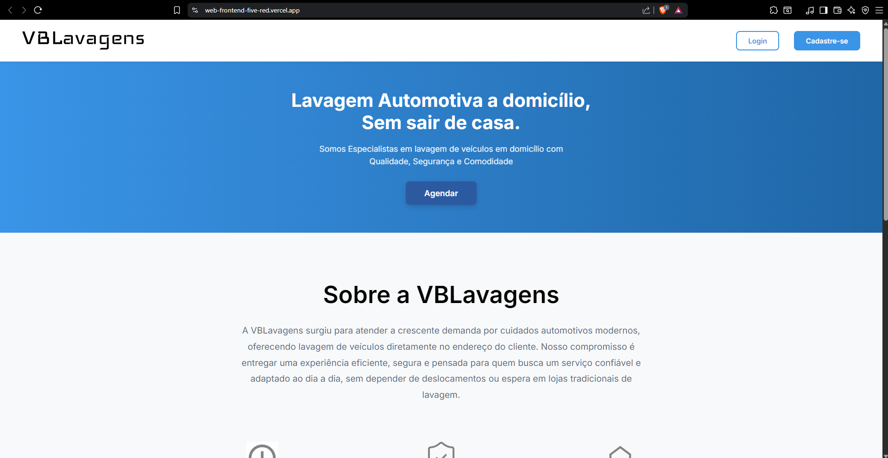

!!! tip "Link de requisito: [RF-C01](../../visao_produto/requisitos_software/#rf-c01) | US: [US-C01](../../backlog/backlog/#us-c01)"
    Implementação: catálogo visível na Home, com navegação para serviços e preços.

**Sobre**
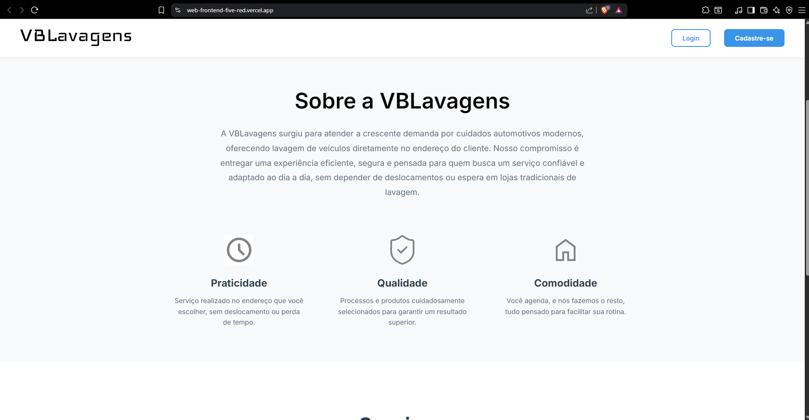

!!! tip "Página informativa (sem RF funcional)"
    Implementação: explica proposta e apoio à navegação.

**Serviços**

!!! tip "Link de requisito: [RF-C01](../../visao_produto/requisitos_software/#rf-c01) | US: [US-C01](../../backlog/backlog/#us-c01)"
    Implementação: listagem de serviços com descrição e preço.

**Cadastro**

!!! tip "Link de requisito: [RF-C03](../../visao_produto/requisitos_software/#rf-c03) | US: [US-C04](../../backlog/backlog/#us-c04)"
    Implementação: formulário simples com e-mail e senha (etapa pré-login).

**Login**
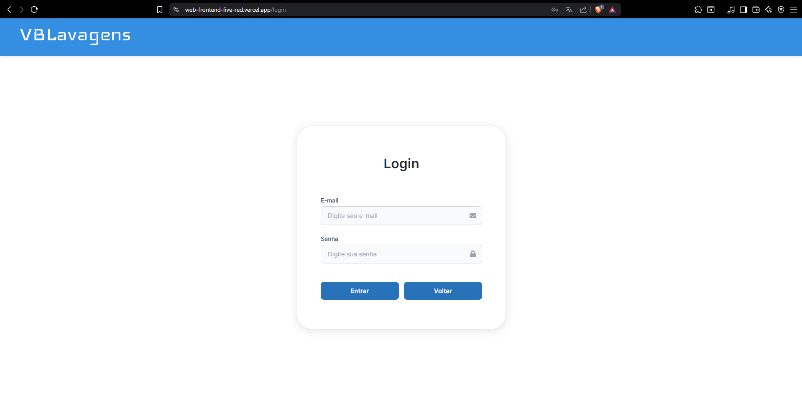

!!! tip "Links de requisito: [RF-C04](../../visao_produto/requisitos_software/#rf-c04) • [RF-A01](../../visao_produto/requisitos_software/#rf-a01) | US: [US-C04](../../backlog/backlog/#us-c04), [US-A01](../../backlog/backlog/#us-a01)"
    Implementação: autenticação de cliente e acesso ao painel admin.

**Agendamento simples**

!!! tip "Links de requisito: [RF-C02](../../visao_produto/requisitos_software/#rf-c02) • [RF-C05](../../visao_produto/requisitos_software/#rf-c05) | US: [US-C03](../../backlog/backlog/#us-c03)"
    Implementação: calendário com seleção de data/horário e início do fluxo de efetivar agendamento.

**Agendamento completo**

!!! tip "Links de requisito: [RF-C02](../../visao_produto/requisitos_software/#rf-c02) • [RF-C05](../../visao_produto/requisitos_software/#rf-c05) | US: [US-C03](../../backlog/backlog/#us-c03)"
    Implementação: confirmação do agendamento com resumo do serviço escolhido.

**Pagamento (PIX)**
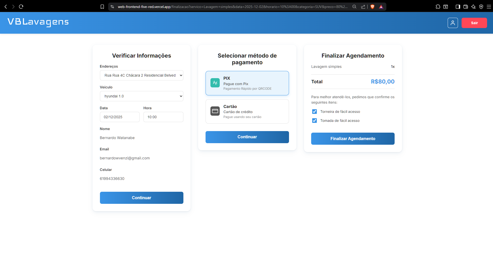

!!! tip "Link de requisito: [RF-C06](../../visao_produto/requisitos_software/#rf-c06) | US: [US-C06](../../backlog/backlog/#us-c06)"
    Implementação: geração de QR Code/código PIX.

**Admin – Serviços**
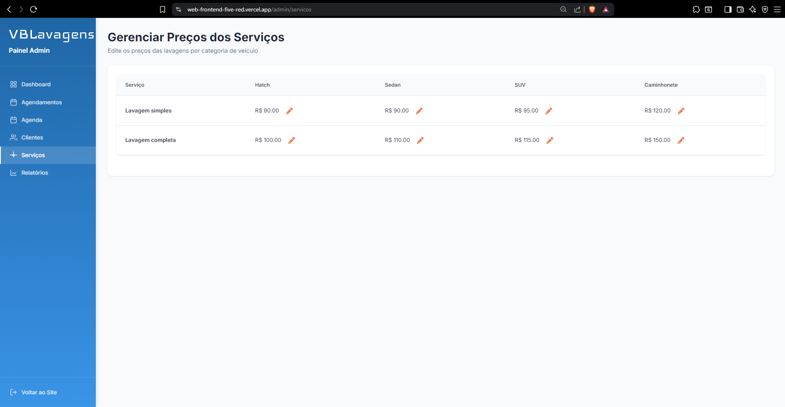

!!! tip "Link de requisito: [RF-A05](../../visao_produto/requisitos_software/#rf-a05) | US: [US-A05](../../backlog/backlog/#us-a05)"
    Implementação: criação/edição/inativação de serviços com preço e duração.

**Admin – Agendamentos**
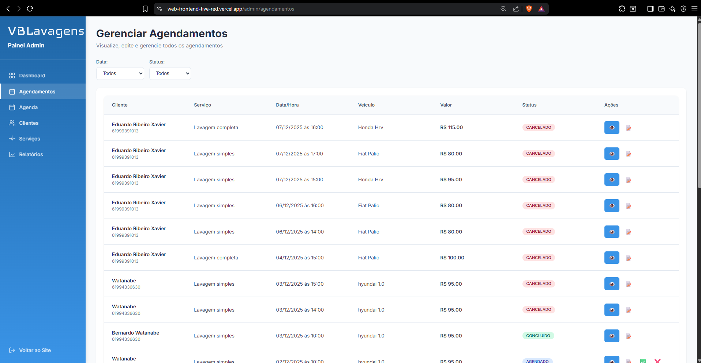

!!! tip "Link de requisito: [RF-A02](../../visao_produto/requisitos_software/#rf-a02) | US: [US-A02](../../backlog/backlog/#us-a02)"
    Implementação: visualizar/editar/cancelar agendamentos e aplicar regra de intervalo mínimo.

**Admin – Agenda**
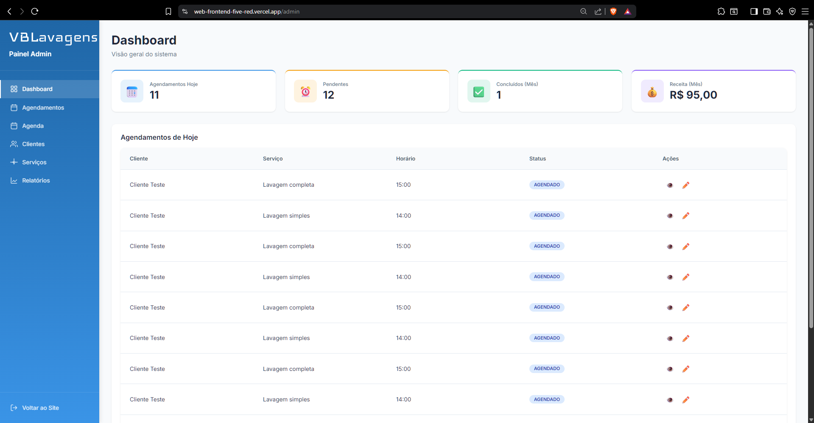

!!! tip "Link de requisito: [RF-A03](../../visao_produto/requisitos_software/#rf-a03) | US: [US-A03](../../backlog/backlog/#us-a03)"
    Implementação: visão diária/semanal consolidada de agendamentos.

**Agendamentos (Cliente)**
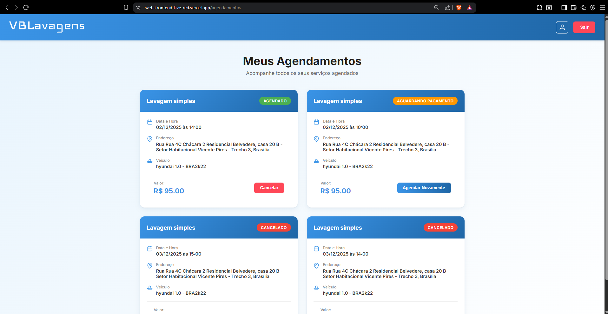

!!! tip "Links de requisito: [RF-C07](../../visao_produto/requisitos_software/#rf-c07) • [RF-C08](../../visao_produto/requisitos_software/#rf-c08) | US: [US-C07](../../backlog/backlog/#us-c07), [US-C05](../../backlog/backlog/#us-c05)"
    Implementação: cancelar agendamento futuro e visualizar histórico/lista de agendamentos do cliente.

## **4. Mídias das Unidades**

| Unidade | Evidência | Link |
| :-- | :-- | :-- |
| Unidade 1 | Vídeo de apresentação | [Entregas das Unidades](./video_unidades.md) |
| Unidade 2 | Vídeo de apresentação | [Entregas das Unidades](./video_unidades.md) |
| Unidade 3 | Feedback do Cliente | [Entregas das Unidades](./video_unidades.md#3-feedback-do-cliente-–-unidade-3) |

### 5. Evidências Técnicas

Aqui resumimos, de forma direta, o que foi entregue no código. Destacamos os PRs de frontend e backend que amarram as telas e as regras de negócio. Os links abaixo apontam para as páginas públicas de PRs; conforme houver merges finais, podemos referenciar commits específicos para reforçar a rastreabilidade. A organização no GitHub está disponível em: [WaveOn-Produto](https://github.com/WaveOn-Produto?view_as=public).

| PR | Escopo Técnico | RF/US Principais Impactados | Próximo Complemento |
| :-- | :-- | :-- | :-- |
| [Frontend – PRs](https://github.com/WaveOn-Produto/web-frontend/pulls) | Build final, organização componentes, fluxo completo de pagamento PIX, refinamento roteamento | RF-C01, RF-C02, RF-C05, RF-C06, RF-C07, RF-C08 / US-C01, US-C03, US-C06, US-C07 | Associar commits e diffs chave |
| [Backend – PRs](https://github.com/WaveOn-Produto/web-backend/pulls) | Endpoints, regras de intervalo e cancelamento, autenticação, serviços, integração PIX, logging básico | RF-C02, RF-C05, RF-C07, RF-C08, RF-A01, RF-A02, RF-A03, RF-A05 / US-C03, US-C05, US-C07, US-A01, US-A02, US-A03, US-A05 | Documentar contratos de API e logs |

#### Detalhamento Visual dos PRs

**Pull Request – Frontend**
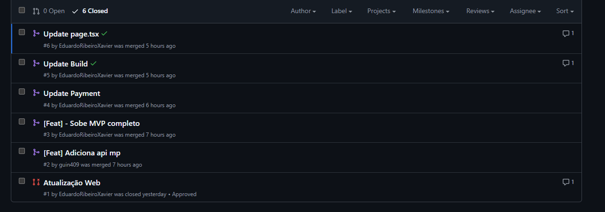

!!! tip "Resumo técnico (PRs públicos)"
    Reúne ajustes finais de build e deploy, organização de componentes, integração do fluxo de pagamento PIX e refinamento da navegação entre Home, Serviços, Agendamento, Pagamento e Histórico. Conecta diretamente as telas evidenciadas no MVP e consolida a camada de apresentação.

**Pull Request – Backend**
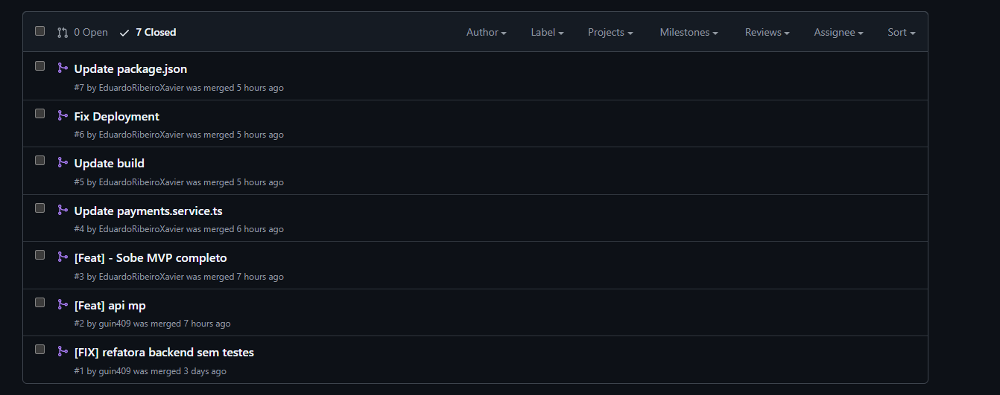

!!! tip "Resumo técnico (PRs públicos)"
    Concentra endpoints de agendamento (criar, listar, cancelar), regra de intervalo mínimo, persistência de serviços e agendamentos, autenticação cliente/admin, integração PIX (geração de QR) e logging básico para auditoria. Dá suporte direto às regras funcionais mostradas nas telas e prepara terreno para evidências de RNFs.

**Deploy & Observabilidade – Frontend (Vercel)**

!!! tip "Status de produção"
    Painel mostra última versão em produção (branch `main`) publicada com sucesso, sem eventos de firewall e taxa de erro 0%. Métricas iniciais de requisições de borda e invocações de funções indicam saúde do deploy. A aplicação está acessível em: [web-frontend-five-red.vercel.app](https://web-frontend-five-red.vercel.app/).

**Histórico de Deploys – Vercel**
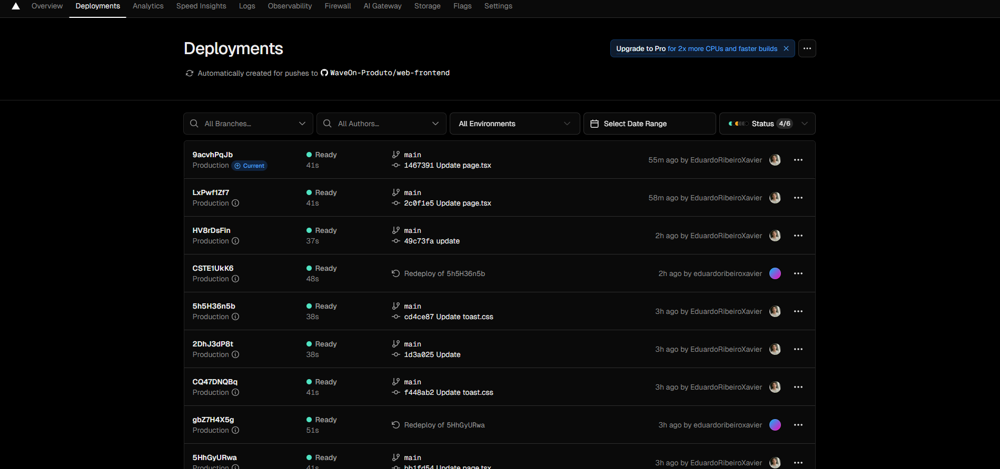

!!! tip "Evolução contínua"
    Sequência de deploys automáticos gerados por pushes para `main`, evidenciando integração contínua. Cada entrada lista commit e status, permitindo futura ligação com PRs e requisitos nas próximas iterações.

