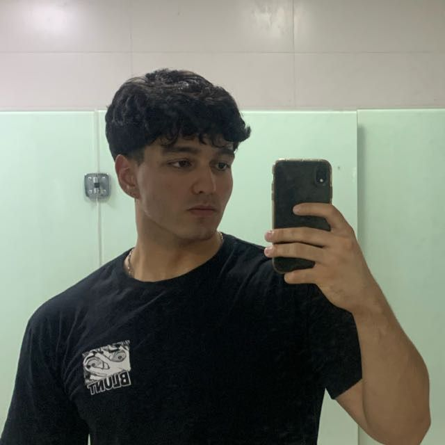

# WaveON 🌊

## Sobre o projeto

Este projeto foi desenvolvido durante a disciplina de Requisitos de Software, na Universidade de Brasília (UnB), sob orientação do Professor Dr. George Marsicano Corrêa.

 

{.logo}

 

O **WaveON** é uma solução tecnológica criada para a empresa *VB*, com o objetivo de transformar a forma como os serviços de lava-jato são oferecidos e gerenciados. A plataforma digital foi idealizada para facilitar o dia a dia dos clientes, permitindo o agendamento online de lavagens, o acompanhamento em tempo real do status do veículo e a praticidade no pagamento dos serviços.

Para a gestão da empresa, o **WaveON** oferece recursos que auxiliam na organização da agenda, no controle de fluxo de atendimentos e na administração financeira, garantindo maior eficiência e transparência nos processos. Além disso, o sistema possibilita o registro do histórico de clientes e veículos, favorecendo um atendimento personalizado e a fidelização.

Com uma interface intuitiva e acessível, o projeto busca unir **inovação, praticidade e automação**, levando a digitalização para um setor tradicional e ampliando o alcance dos serviços da empresa *VB*. Dessa forma, o **WaveON** não apenas otimiza o funcionamento interno do negócio, como também proporciona uma experiência mais cômoda e confiável para seus clientes.

## Nossa Equipe 👥

  

    
    Líder
    Bernardo Watanabe
  

  

    
    Bernardo Broetto
  

  

    
    Douglas Wilson
  

 

  

    
    Eduardo Ribeiro
  

  

    
    Guilherme Negreiros
  

  

    
    Anna Clara Cardoso
  

