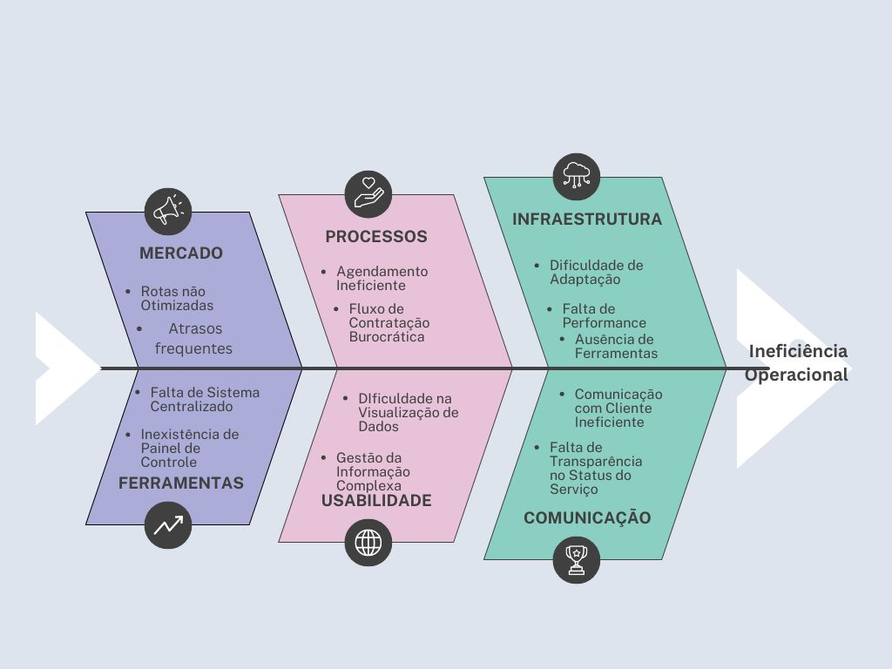

## 1.1  Introdução ao negócio e Contexto 🚗

Dentro do mercado de serviços automobilístico no Brasil, teve-se um aumento significativo na venda e compra destes veículos durante os anos, fazendo com que surgisse uma
maior necessidade de serviços de manutenção e bem estar destes produtos.

Com isso em mente, A empresa *VB*, foca em oferecer a melhor lavagem de carros a domicílio possível,
e tem como alvo clientes que preferem uma lavagem no conforto de sua casa.

Oferecendo serviços remotos aos seus clientes, a empresa busca manter o cliente o mais
confortável possível sem ter a necessidade de se deslocar para realizar a lavagem. Muito
diferente do habitual, onde grande parte das lojas de "lava-rápido" realizam seus serviços
em locais fixos.

---

## 1.2 Identificação da Oportunidade 🔍
Nos últimos anos, os serviços remotos de lava-jato têm crescido constantemente, impulsionando o interesse e a procura dos clientes. Esse crescimento, no entanto, traz consigo diversos desafios para as empresas. A gestão da informação e a administração se tornam complexas, especialmente para visualizar os agendamentos e as necessidades dos clientes.

A logística de deslocamento é outro obstáculo importante: uma dificuldade acaba gerando outra, afetando diretamente a pontualidade e a eficiência. Situações como atrasos nos pedidos e uma experiência de compra frustrante são comuns, o que pode limitar as vendas e a fidelização dos clientes. Além disso, a falta de controle e organização pode levar à diminuição da qualidade do serviço.

--- 

!!! warning "Causa principal"
    Grande parte dessas falhas surge da ausência de ferramentas adequadas para listar, organizar e agendar os serviços.  
    A ineficiência nas operações acaba prejudicando o negócio e impede a empresa de atender de forma ágil e organizada.

!!! tip "Oportunidade"
    O cenário mostra espaço para adoção de ferramentas **modernas e atualizadas** que otimizem processos e melhorem a experiência tanto para os clientes quanto para a empresa.

---

### Gráfico de Ishikawa 📊
A figura a seguir apresenta o Diagrama de Ishikawa sobre o problema enfretado pela *VB*:

---

## 1.3 Desafios do Projeto 🧗
A empresa VB enfrenta uma série de desafios que se estendem para além da simples
operação de seus serviços. Entre os principais problemas, destaca-se a necessidade de uma
constante visualização e análise dos dados de serviço e das informações dos clientes. 

---

A falta de um sistema adequado para acompanhar essas métricas e priorizar atendimentos
pode gerar ineficiência, especialmente em um cenário onde a quantidade de pedidos é alta
e a priorização correta dos clientes se torna crucial para a satisfação e a rentabilidade.
Além dos desafios técnicos, a organização é um ponto crítico. A empresa precisa de
uma forma mais eficaz de agendar e gerir informações, além de um método mais fácil e
direto para se comunicar com os clientes. A dificuldade de adaptação a novas ferramentas
também surge como um obstáculo, pois a implementação de um software, como uma
aplicação web, exigirá um processo de transição e treinamento.
Embora o orçamento não seja uma preocupação central no momento, a capacidade de
equilibrar custo, qualidade e entrega é um desafio inerente ao modelo de negócio. 

Em suma, a superação desses obstáculos não se resume apenas à implementação de um novo
software. Trata-se de um processo de adaptação e evolução que exige uma mudança na
cultura da empresa, focada na otimização de processos, na adoção de tecnologias e na
busca contínua por eficiência operacional.

---

## 1.4 Segmentação de Clientes 🎯
👤 A empresa VB atende os três principais segmentos de clientes:

!!! note "Clientes Idosos e com Mobilidade Reduzida (acima de 60 anos)"
    Este grupo busca o serviço remoto por questões de saúde ou idade que os impedem de ir até um lava-jato tradicional. A conveniência do atendimento em casa é essencial para
    atender às suas necessidades.

!!! note "Clientes que Buscam Conforto e Praticidade (25-45 anos)"
    São adultos que, por preferência, optam pela comodidade de agendar o serviço no local de sua
    escolha. Eles valorizam a conveniência de não precisar se deslocar, tornando a rotina
    mais fácil.

!!! note "Profissionais e Empresas (acima de 30 anos)" 
    Este grupo inclui gestores de frota, autônomos e executivos com a agenda apertada, que valorizam a otimização
    do tempo. Eles utilizam o serviço para manter veículos da empresa ou pessoais
    limpos, sem que isso interfira na sua produtividade diária.

---

## Hisórico de Versão 🔄

| Data       | Versão | Descrição                                         | Autor(es)        | Revisor(es)     |
|------------|--------|---------------------------------------------------|------------------|-----------------|
|            |        |                                                   |                  |                 |
|            |        |                                                   |                  |                 |
|            |        |                                                   |                  |                 |
|            |        |                                                   |                  |                 |
|            |        |                                                   |                  |                 |
